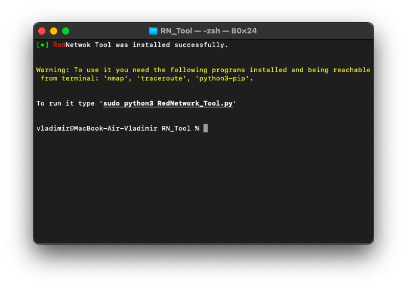

# 🌐🔍 Red Network Tool (أداة شبكة ريد)  


## What is RedNetwork Tool?
_Red Network Tool_ is a tool for network exploration and info finding over the internet. _`There is a config feature!`_

Current tool version consist of:
- Ifconfig.
- Port scan(comprehensive, TCP, SYN, ACK, UDP).
- Host discovery(scan for up devices on a local network).
- DNS checks with geolocation information.
- Banner grabbing.
- Ping(send ICMP packets to a host to check connectivity).
- Traceroute(diagnose route paths and measure transit delays).
- Reverse ip lookup.
- Censys.
- Site technologies detection feature.
- Honeypot probability.
- Mac address lookup.
- Dns mapping.

## Supported Devices:
 This program is supported in all operating system like _Linux_, _Windows_ and _MacOS_. The Code is written in _python3_, so don't worry it works well without any bugs.
 
## Installing (_Windows/Linux/MacOS_):
```diff
git clone https://github.com/Red-company/RedNetwork_Tool.git
cd RN_Tool
bash setup.sh

! After executing setup.sh, you'll need to edit newly created config.py

sudo python3 RedNetwork_Tool.py
```

## How to use? Let's figure it out:

### Ifconfig
If you want to display your system's current _TCP/IP_ network configuration, type the following command:

`-ifconfig`


### Ports scanning
Supported types:
- _SYN_ (`-scansyn`)
- _TCP_ (`-scantcp`) 
- _UDP_ (`-scanudp`)
- _ACK_ (`-scanack`)
- _Comprehensive scan_ (`-scan`).

`-scan -host [HOST(s)]`

`-scan -host [HOST(s)] -p [PORT(s)]`

`-scan -host [HOST(s)] -prange [START PORT] [END PORT]`

`-scan -iprange [START IP] [END IP] -p [PORT(s)]`

`-scan -iprange [START IP] [END IP] -prange [START PORT] [END PORT]`


### Local scan
Perform scan to detect local devices.

`-scanlocal`


### DNS check
Similar to the well known _`nslookup`_ command used on _UNIX_ systems.

`-ns [HOST(s)]`


### Banner grabbing
To perform _banner grabbing_, type one of the following commands:

`-grab -host [HOST(s)] -p [PORT(s)]`

`-grab -iprange [START IP] [END IP] -prange [START PORT] [END PORT]`

`-grab -host [HOST(s)] -prange [START PORT] [END PORT]`

`-grab -iprange [START IP] [END IP] -p [PORT(s)]`


### Ping
Uses to send _ICMP_ packets to a host to check connectivity, simply type:

`-ping [HOST]`


### Traceroute
Uses to diagnose route paths and measure _transit delays_, use the following command:

`-traceroute [HOST]`


### Reverse ip lookup
Uses to perform a _reverse ip lookup_, to perform write:

`-reverseip [HOST]`


### Censys
_Censys_ feature, just type:

`-censys [HOST]`


### TechDetect
Uses to detect site's _technologies_. Type:

`-techdetect [URL]`


### Honeypot
Uses to calculate probability of ip being _honeypot_. To calculate just type:

`-honeypot [IP]`


### Mac address lookup
You can check information about certain _mac address_ with it, type:

`-macaddress [MAC]`


### Dns map
Do you want to get a _map of dns servers_ of certain organization? Okay, here it is:

`-dnsmap [DOMAIN]`


## More screenshots? Here they are:





##
All material in this repository is in the public domain.
